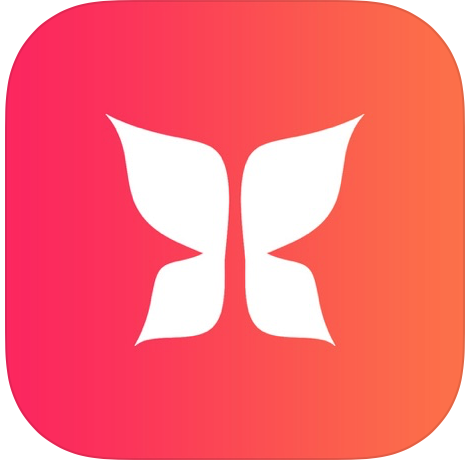

# EmptyStateKit

[](https://cocoapods.org/pods/EmptyStateKit)
[](https://cocoapods.org/pods/EmptyStateKit)
[](https://cocoapods.org/pods/EmptyStateKit)


## Table of Contents

- [Description](#description)
- [Example](#example)
- [Installation](#installation)
- [Usage](#usage)
    - [1. Complete empty states data](#1-complete-empty-states-data)
    - [2. Show or hide your empty state](#2-show-or-hide-your-empty-state)
    - [3. Handling button action with EmptyStateDelegate](#3-handling-button-action-with-emptystatedelegate)
- [Format](#format)
- [Animation Types](#animation-types)
- [Position Types](#position-types)
- [Apps using EmptyStateKit](#apps-using-emptystatekit)
- [Author](#author)
- [Contributing](#contributing)
- [License](#license)

## Description

Empty states are actually a great way to engage, keep and delight users at critical moments. Use `EmptyStateKit` to make your app even more interesting and add a bit of fun to the UI interactions whenever the view has no content to display. Display awesome placeholder empty state in any UIView or UITableView/UICollectionView with refresh content features. It is super-useful to speed up a mobile development workflow due to its flexibility and ease of use.  `EmptyStateKit` is written in Swift 5.

- [x] Awesome fade & scale animations
- [x] Totally customizable
- [x] Use it also in your own tables and collection views
- [x] Easy usage
- [x] Supports iOS, developed in Swift 5

## Example

To run the example project, clone the repo, and run `pod install` from the Example directory first.

<p align="center" >

</p>

## Installation

EmptyStateKit is available through [CocoaPods](https://cocoapods.org). To install
it, simply add the following line to your Podfile and run `pod install`:

```ruby
pod 'EmptyStateKit'
```

Then you can import it when you need

```swift
import EmptyStateKit
```

## Usage

It's important, when an error or empty state occurs, to inform or teach the user how to recover from the error or how to populate the screen with content. Keep in mind to give your users a next step, like  a link to another section, a button to recover from an error or content to interact with. This will help you to increase engagement! In the example you will see multiple types of empty states and how you can customize them. Be creative!. 

---

Once you've installed the pod, follow next steps. It's really simple:

### 1. Complete empty states data

To complete empty states data, you can choose implementing EmptyStateDataSource or extend your custom enum states with image, title, description and titleButton params. 
>I recommend the second option to keep states data outside your view controller.

#### Using EmptyStateDataSource

Implement `EmptyStateDataSource` and complete with each custom state you have.

```swift
extension ViewController: EmptyStateDataSource {

    func imageForState(_ state: CustomState, inEmptyState emptyState: EmptyState) -> UIImage? {
        switch state as! MainState {
        case .noInternet: return UIImage(named: "Internet")
        }
    }

    func titleForState(_ state: CustomState, inEmptyState emptyState: EmptyState) -> String? {
        switch state as! MainState {
        case .noInternet:  return "We’re Sorry"
        }
    }

    func descriptionForState(_ state: CustomState, inEmptyState emptyState: EmptyState) -> String? {
        switch state as! MainState {
        case .noInternet: return "Our staff is still working on the issue for better experience"
        }
    }

    func titleButtonForState(_ state: CustomState, inEmptyState emptyState: EmptyState) -> String? {
        switch state as! MainState {
        case .noInternet: return "Try again?"
        }
    }
}
```

Remember to assign dataSource to your empty state view

```swift
view.emptyState.dataSource = self
```

#### Using CustomState enum

You can implement  image, title, description and titleButton params for each state. Create your custom states enum that implements `CustomState`. Then complete with required params:

```swift
enum State: CustomState {

    case noNotifications
    case noSearch
    case noInternet

    var image: UIImage? {
        switch self {
        case .noNotifications: return UIImage(named: "Messages")
        case .noSearch: return UIImage(named: "Search")
        case .noInternet: return UIImage(named: "Internet")
        }
    }

    var title: String? {
        switch self {
        case .noNotifications: return "No message notifications"
        case .noSearch: return "No results"
        case .noInternet: return "We’re Sorry"
        }
    }

    var description: String? {
        switch self {
        case .noNotifications: return "Sorry, you don't have any message. Please come back later!"
        case .noSearch: return "Please try another search item"
        case .noInternet: return "Our staff is still working on the issue for better experience"
        }
    }

    var titleButton: String? {
        switch self {
        case .noNotifications: return "Search again?"
        case .noSearch: return "Go back"
        case .noInternet: return "Try again?"
        }
    }
}

```

### 2. Show or hide your empty state

This step is really simple ;) 

```swift
view.emptyState.show(State.noInternet)
```

You can use empty states in your Table or Collection views maintaining refreshing content features. For this, table or collection view must be empty (0 rows). `EmptyStateKit` will complete the table or collection background view and remove the separatorStyle to show your empty state.

### 3. Handling button action with EmptyStateDelegate

Implement `EmptyStateDelegate` protocol to delegate the button action.

```swift
extension ViewController: EmptyStateDelegate {

    func emptyState(emptyState: EmptyState, didPressButton button: UIButton) {
        view.emptyState.hide()
    }
}
```

Remember to assign delegate to your empty state view

```swift
view.emptyState.delegate = self
```

## Format

You can format your empty states or use default values. See `EmptyStateFormat` default values:

```swift
/// Title attributes
public var titleAttributes: [NSAttributedString.Key: Any] = [.font: UIFont(name: "AvenirNext-DemiBold", size: 26)!, .foregroundColor: UIColor.darkGray]

/// Description attributes
public var descriptionAttributes: [NSAttributedString.Key: Any] = [.font: UIFont(name: "Avenir Next", size: 14)!, .foregroundColor: UIColor.darkGray]

/// Button attributes
public var buttonAttributes: [NSAttributedString.Key: Any] = [.font: UIFont(name: "AvenirNext-DemiBold", size: 14)!, .foregroundColor: UIColor.white]

/// Button color
public var buttonColor: UIColor = .red

/// Button shadow radius
public var buttonShadowRadius: CGFloat = 0

/// Button corner radius
public var buttonRadius: CGFloat = 20.0

/// Button width, nil = auto
public var buttonWidth: CGFloat? = nil

/// Button top margin
public var buttonTopMargin: CGFloat = 20

/// Set image as background
public var coverImage: Bool = false

/// Image animation type
public var animation: EmptyStateAnimation? = .scale(0.3, 0.3)

/// Alpha container
public var alpha: CGFloat = 1.0

/// Tint color for template image
public var imageTintColor: UIColor? = nil

/// Background color
public var backgroundColor: UIColor = .white

/// Background Gradient color
public var gradientColor: (UIColor, UIColor)? = nil

/// Position
public var position = EmptyStatePosition()

/// Margin for vertical position
public var verticalMargin: CGFloat = 40

/// Left & right margin
public var horizontalMargin: CGFloat = 40

/// Image size
public var imageSize: CGSize = CGSize(width: 200, height: 200)
```

Remember to assign format object to your empty state view.

```swift
view.emptyState.format = format
```

## Animation Types

### Fade

This type will make first fade animation with text and second fade animation with the image when empty state appears

```swift
format.animation = EmptyStateAnimation.fade(0.3, 0.3) 
```
>(Text fade animation duration, Image fade animation duration)

### Scale

This type will make first fade animation with text and second scale animation with the image when empty state appears

```swift
format.animation = EmptyStateAnimation.scale(0.3, 0.3) 
```
>(Text fade animation duration, Image scale animation duration)


## Position Types

### EmptyStateViewPosition

```swift
public enum EmptyStateViewPosition {
    case top
    case center
    case bottom
}
```

### EmptyStateTextPosition

```swift
public enum EmptyStateTextPosition {
    case left
    case center
    case right
}
```

### EmptyStateImagePosition

FYI: Content mode images are `Aspect Fit` 

```swift
public enum EmptyStateImagePosition {
    case top
    case bottom
    case cover(MarginTop?, MarginBottom?) 
}
```

>Cover image will be setted by (Cover margin top image, Cover margin bottom image)

## Apps using EmptyStateKit

If you use `EmptyStateKit` I'd love to hear about it and feature your app here!

 [FashTime](https://itunes.apple.com/app/fashtime-the-new-way/id1126538070?mt=8)

## Author

Alberto Aznar, info@alberdev.com.
The example contains some illustrations made by [Angga Risky](https://www.youtube.com/channel/UCG1aEPR4NO2Sd_mmJFimfQQ) and [Sweetie](https://dribbble.com/sweetie).

## Contributing

Feel free to collaborate with ideas 💭, issues ⁉️ and/or pull requests 🔃.

1. Fork it!
2. Create your feature branch: `git checkout -b my-new-feature`
3. Commit your changes: `git commit -am 'Add some feature'`
4. Push to the branch: `git push origin my-new-feature`
5. Submit a pull request :D

## License

EmptyStateKit is available under the MIT license. See the LICENSE file for more info.
